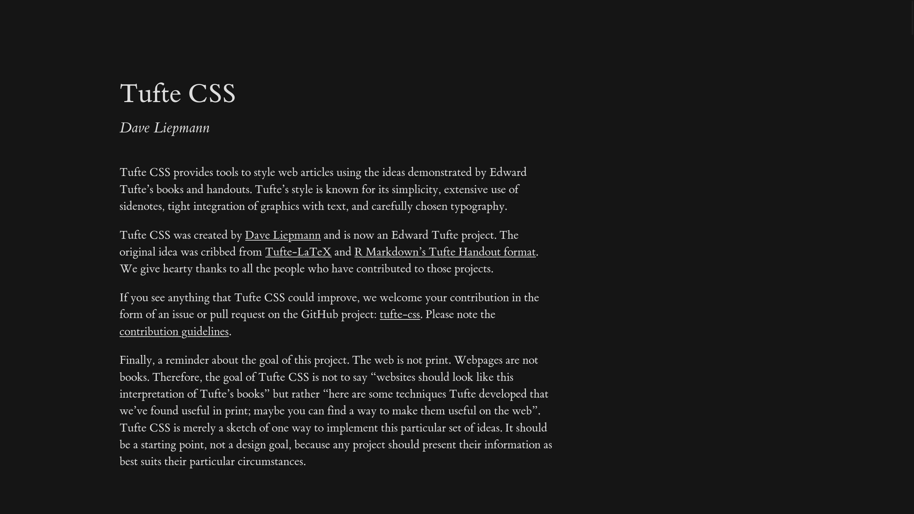
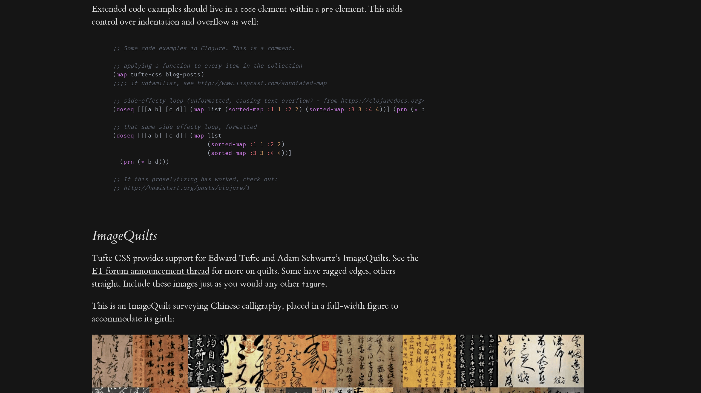

# Minimal Tufte Blog Template

A minimal blog template built on the wonderful
[tufte-css](https://github.com/edwardtufte/tufte-css).

The template is intentionally minimal to reduce the number of moving parts.

We use [mdsvex](https://github.com/pngwn/mdsvex) for parsing markdown, and
[rehype-katex-svelte](https://github.com/kwshi/rehype-katex-svelte) for LaTeX
support.

All assets live in `./static`, including `prismjs.css` for syntax highlighting
theming. The chosen theme is One Dark, with the background removed to fit the
Tufte aesthetic. Assets are made to be relatively static to allow for happier
hacking.

The repo includes sample content and a few helper components to speed up
development.

Demo posts can be found in `./src/posts/`.

Made with love and without AI.

